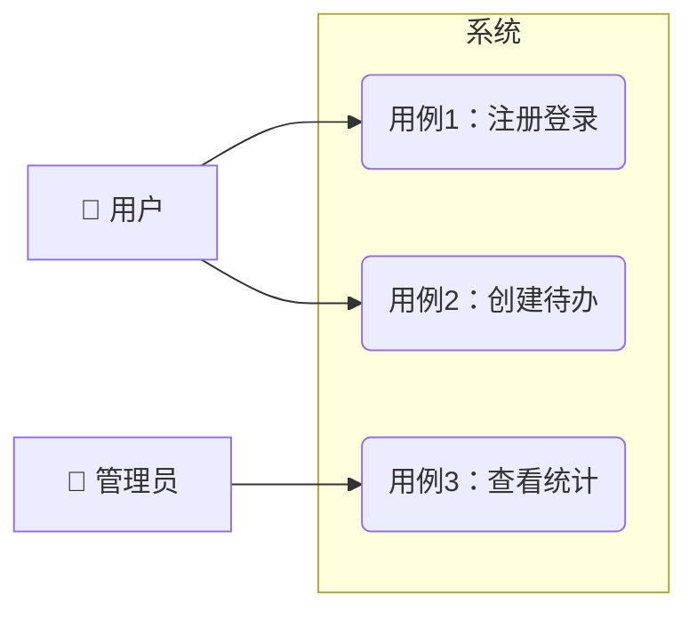
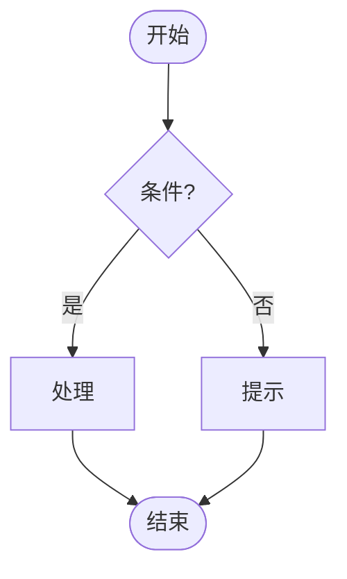

# 需求规格说明书（SRS）模板

> 使用说明：生成 SRS 时套用本模板。"待确认"条目必须在人工检查点请用户确认，禁止编造。图表用 Mermaid 语法。

## 1. 项目概述

- **项目名称**：
- **一句话描述**：
- **目标用户**：
- **要解决的核心问题**：

## 2. 参与者与用例

### 2.1 参与者（Actor）

| 参与者 | 说明 |
|--------|------|
| 用户 | |
| 管理员 | |
| 外部系统 | |

### 2.2 用例图

用 Mermaid 流程图近似表达参与者和用例的关系：

### 2.3 核心用例描述

每个关键用例一张表：

| 项 | 内容 |
|----|------|
| 用例编号 | UC-1 |
| 用例名称 | |
| 参与者 | |
| 前置条件 | |
| 主流程 | 1. … 2. … 3. … |
| 扩展流程 | 3a. 输入非法时 → 提示错误 |
| 后置条件 | |

## 3. 业务流程图

至少覆盖一条端到端的主业务流程，含判断分支：

### 3.1 检查点场景走查示例

> 人工检查点 1 使用：抽象的需求清单容易被一路点头通过，具体例子才能暴露理解偏差。用 1~2 个端到端实例（含至少一个失败/边界场景）带用户走一遍"触发条件 → 系统行为 → 用户可观察结果"；走查中用户的修正视同澄清回答，更新 SRS 后再请确认。

| # | 场景类型 | 谁 / 在什么情况下 / 做了什么 | 系统应该怎样 | 用户最终看到/得到什么 |
|---|----------|------------------------------|--------------|------------------------|
| 1 | 正常路径 | 如：新用户在空列表页输入"买牛奶"后回车 | 校验通过、写入存储、列表刷新 | 列表首行出现"买牛奶"，空列表提示消失 |
| 2 | 失败/边界 | 如：用户在输入框粘贴 10001 个字符后提交 | 拒绝写入并提示长度上限 | 列表无变化，输入框下方显示"最多 10000 字" |

### 3.2 界面与交互（有 UI 的项目）

> 有 UI 的项目必须填写本节——"自然语言 + 原型"才是用户能签字确认的东西，也为阶段 2 的 UI 技术选型与阶段 4 的界面用例提供依据。无 UI 的项目（CLI/库/后端服务）省略本节，交互需求由核心用例描述与 3.1 场景走查承担。

**页面/界面清单**：

| 页面/界面 | 入口 | 主要元素 | 对应用例 |
|-----------|------|----------|----------|
| | | | UC-x |

**页面流转图**（含跳转、返回与错误路径）：

**关键交互与反馈**（异常反馈必须具体到"在哪里、以什么形式提示什么"——它们将被验收标准与界面用例直接引用）：

| 交互点 | 用户操作 | 系统反馈（正常） | 系统反馈（异常） |
|--------|----------|------------------|------------------|
| | | | |

## 4. 功能需求

| 编号 | 需求描述 | 关联用例 | 优先级 | 验收标准（可自动验证） |
|------|----------|----------|--------|------------------------|
| FR-1 | | UC-1 | 必须 | |
| FR-2 | | UC-2 | 必须 | |

优先级用 MoSCoW：必须有（Must）/ 应该有（Should）/ 可以有（Could）/ 暂不做（Won't）。

验收标准要求：每条都必须给出可操作的验证方式（具体数值、可执行的检查步骤、可观察的输出）。示例：
- ✅ "提交空表单时，输入框下方显示红色提示'必填'"
- ✅ "1000 条数据的列表查询响应时间 ≤ 2 秒"
- ❌ "操作方便""响应快""界面美观"

## 5. 非功能需求

| 编号 | 类别 | 要求 | 验证方式 | 本环境可验证性 |
|------|------|------|----------|----------------|
| NFR-1 | 性能 | | | 可行 / 不可行：缺什么条件（如需压测集群、特定硬件） |
| NFR-2 | 安全 | | | 可行 |
| NFR-3 | 兼容性 | | | 可行 |

> 可验证性在**需求阶段**就判定，不要留到阶段 4 才发现跑不了：当前环境无法验证的 NFR 在此明确标注所需条件，检查点 1 必须向用户显著展示这份清单（"这些验收标准交付时只能标未验证"）。需求阶段告知、用户知情，与阶段 4 的 BLOCKED 兜底构成前后两道关。

## 6. 系统边界

- **本期不做**：（明确列出，防止需求蔓延）
- **外部依赖**：（第三方接口、现有系统等）

## 7. 待确认问题与默认假设

### 7.1 待确认问题

| # | 问题 | 影响 | 状态 |
|---|------|------|------|
| 1 | | | 待用户确认 |

### 7.2 已按默认值处理的假设

> 两轮澄清后仍未获得答案的缺口，按合理默认值继续推进时必须在此登记——人工检查点要向用户逐条展示这份"我替你假设了什么"的清单，它与"待确认问题"不同：前者已带着假设往下走，后者仍悬而未决。用户在检查点可否决任一假设。

| # | 缺口 | 采用的默认值 | 这样假设的理由 | 若假设错误的影响 |
|---|------|--------------|----------------|------------------|
| 1 | | | | |

## 8. 需求变更记录

| 日期 | 变更内容 | 提出方 | 原因 |
|------|----------|--------|------|
| | | | |

## 9. 产出物自检

> 通用规则"对照模板逐项自检"的落点；全部勾选后才提交用户确认。

- [ ] 每条功能需求附带可自动验证的验收标准（无"响应快""操作方便"类表述）
- [ ] 缺失信息标记"待确认"，无编造内容
- [ ] 按默认值处理的缺口全部登记在 7.2 假设表（含默认值、理由、影响），无未登记的隐性假设
- [ ] 用例图、核心用例描述表、端到端业务流程图齐全
- [ ] 3.1 场景走查示例已写（1~2 个端到端实例，含至少一个失败/边界场景），供检查点 1 带用户确认
- [ ] 有 UI 的项目：3.2 界面与交互已写（页面清单、页面流转图、关键交互反馈具体到位置与形式）；无 UI 项目已明确省略
- [ ] 非功能需求逐条标注了验证方式
- [ ] 每条 NFR 判定了本环境可验证性；不可行的已注明所需条件并将在检查点 1 向用户展示
- [ ] 系统边界"本期不做"明确列出

