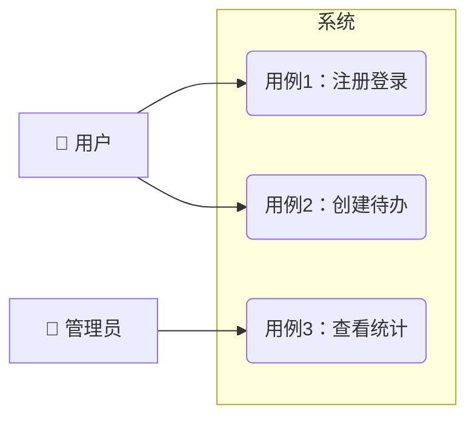

# 需求规格说明书（SRS）模板

> 使用说明：生成 SRS 时套用本模板。"待确认"条目必须在人工检查点请用户确认，禁止编造。图表用 Mermaid 语法。

## 1. 项目概述

- **项目名称**：
- **一句话描述**：
- **目标用户**：
- **要解决的核心问题**：

## 2. 参与者与用例

### 2.1 参与者（Actor）

| 参与者 | 说明 |
|--------|------|
| 用户 | |
| 管理员 | |
| 外部系统 | |

### 2.2 用例图

用 Mermaid 流程图近似表达参与者和用例的关系：

### 2.3 核心用例描述

每个关键用例一张表：

| 项 | 内容 |
|----|------|
| 用例编号 | UC-1 |
| 用例名称 | |
| 参与者 | |
| 前置条件 | |
| 主流程 | 1. … 2. … 3. … |
| 扩展流程 | 3a. 输入非法时 → 提示错误 |
| 后置条件 | |

## 3. 业务流程图

至少覆盖一条端到端的主业务流程，含判断分支：

## 4. 功能需求

| 编号 | 需求描述 | 关联用例 | 优先级 | 验收标准（可自动验证） |
|------|----------|----------|--------|------------------------|
| FR-1 | | UC-1 | 必须 | |
| FR-2 | | UC-2 | 必须 | |

优先级用 MoSCoW：必须有（Must）/ 应该有（Should）/ 可以有（Could）/ 暂不做（Won't）。

验收标准要求：每条都必须给出可操作的验证方式（具体数值、可执行的检查步骤、可观察的输出）。示例：
- ✅ "提交空表单时，输入框下方显示红色提示'必填'"
- ✅ "1000 条数据的列表查询响应时间 ≤ 2 秒"
- ❌ "操作方便""响应快""界面美观"

## 5. 非功能需求

| 编号 | 类别 | 要求 | 验证方式 |
|------|------|------|----------|
| NFR-1 | 性能 | | |
| NFR-2 | 安全 | | |
| NFR-3 | 兼容性 | | |

## 6. 系统边界

- **本期不做**：（明确列出，防止需求蔓延）
- **外部依赖**：（第三方接口、现有系统等）

## 7. 待确认问题

| # | 问题 | 影响 | 状态 |
|---|------|------|------|
| 1 | | | 待用户确认 |

## 8. 需求变更记录

| 日期 | 变更内容 | 提出方 | 原因 |
|------|----------|--------|------|
| | | | |

## 9. 产出物自检

> 通用规则"对照模板逐项自检"的落点；全部勾选后才提交用户确认。

- [ ] 每条功能需求附带可自动验证的验收标准（无"响应快""操作方便"类表述）
- [ ] 缺失信息标记"待确认"，无编造内容
- [ ] 用例图、核心用例描述表、端到端业务流程图齐全
- [ ] 非功能需求逐条标注了验证方式
- [ ] 系统边界"本期不做"明确列出

