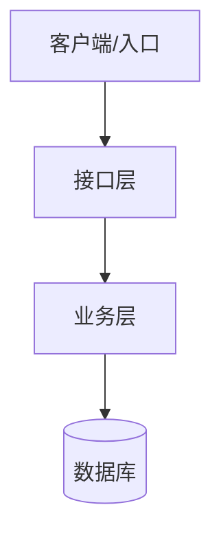
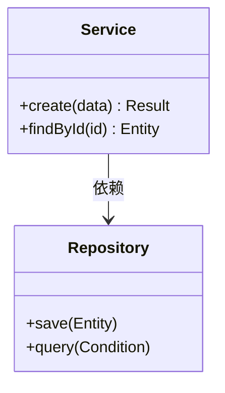
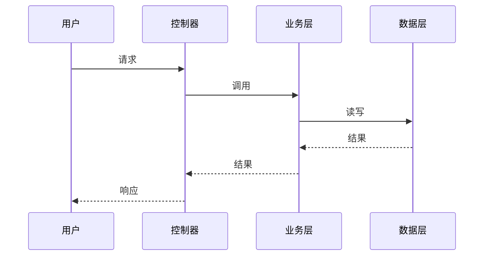
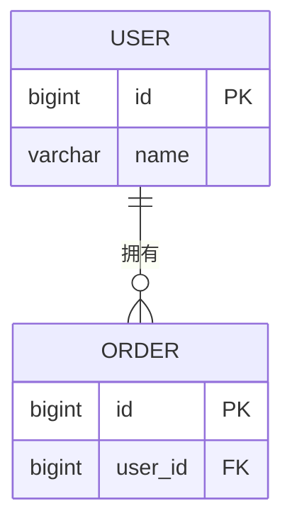

# 设计文档模板

> 使用说明：以 docs/01-srs.md 为唯一输入填写。所有图表用 Mermaid 语法。文档末尾必须附需求覆盖对照表。

## 1. 技术选型

| 层面 | 选择 | 理由 |
|------|------|------|
| 语言/框架 | | |
| 数据库 | | |
| 主要依赖 | | |

原则：满足当前需求前提下选最简单的方案；不引入需求没有要求的技术组件。

## 2. 系统架构图



## 3. 模块划分

| 模块 | 职责 | 对应需求 |
|------|------|----------|
| | | FR-x |

模块间依赖关系（Mermaid）：


## 4. 核心类图

表达主要类/组件的职责与关系（继承、组合、依赖）：



## 5. 关键流程时序图

每个核心场景一张（从需求的关键用例推导）：



## 6. 数据库设计

E-R 图（Mermaid）：



表结构明细（表名、字段、类型、约束、索引）：

| 表 | 字段 | 类型 | 约束/索引 | 说明 |
|----|------|------|-----------|------|
| | | | | |

## 7. 状态图（可选）

存在状态流转的对象（如订单：待支付→已支付→已完成）时绘制：


## 8. 非功能性设计

SRS 中每条 NFR 在设计层的落实方式（没有对应设计的 NFR 要么补设计，要么说明为何不需要）：

| 需求编号 | 类别 | 设计对策 |
|----------|------|----------|
| NFR-1 | 性能 | 如：列表查询加索引/分页、热点数据缓存 |
| NFR-2 | 安全 | 如：接口鉴权方式、输入校验层、密码哈希算法 |
| NFR-3 | 可用性 | 如：错误兜底页、数据备份策略 |

## 9. 接口定义

| 接口 | 方法 | 路径/签名 | 入参 | 出参 | 错误码 |
|------|------|-----------|------|------|--------|
| | | | | | |

接口必须给出调用示例（含一个失败场景示例）。

## 10. 目标目录结构

```
（设计中的项目目录树，标注各目录职责）
```

## 11. 设计变更记录

| 日期 | 变更内容 | 原因 | 关联需求 |
|------|----------|------|----------|
| | | | |

## 12. 需求覆盖对照表

| 需求编号 | 需求摘要 | 由哪些模块/接口实现 |
|----------|----------|---------------------|
| FR-1 | | |
| NFR-1 | | |

## 13. 产出物自检

> 通用规则"对照模板逐项自检"的落点；全部勾选后才进入任务拆解。

- [ ] 覆盖对照表无缺口：每条 FR/NFR 都有设计落点
- [ ] 每个关键用例至少对应一张时序图
- [ ] 每条 NFR 都有设计对策（或说明为何不需要）
- [ ] 技术选型有理由，未引入需求之外的技术组件（防过度设计）
- [ ] 架构图、类图、时序图、数据设计齐全且与文字描述一致

