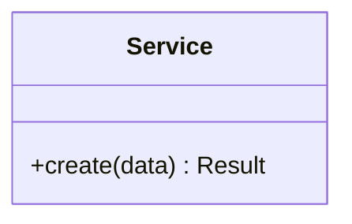

# 开发文档模板

> 使用说明：阶段 3 编码过程中同步填写、编码完成后定稿。记录"实际实现了什么"，与 docs/02-design.md（"计划怎么做"）互补。无论从零开始还是基于已有工程改造，都要填写。

## 1. 工程背景

- **工程类型**：从零新建 / 基于已有工程改造
- **改造类项目须说明**：接手的工程现状（技术栈、目录、构建方式）、本次改动涉及的模块

## 2. 实现概述

- 与设计文档的关键差异及原因（没有差异则写"与设计一致"）：

| 设计约定 | 实际实现 | 差异原因 |
|----------|----------|----------|
| | | |

## 3. 实际目录结构

```
（实际生成的目录树，标注各目录职责）
```

## 4. 实现类图

按实际代码绘制（应与设计类图对应，出现偏差时以本图为准并在第 2 节说明原因）：



## 5. 接口/模块实现清单

| 设计接口/模块 | 实现位置（文件） | 状态 | 备注 |
|---------------|------------------|------|------|
| | | 已完成/部分 | |

## 6. 单元测试清单

| 测试文件 | 被测类/模块 | 用例数 | 来源用例 ID | 覆盖场景 |
|----------|-------------|--------|-------------|----------|
| | | | （对应 04-test-cases.md 的用例 ID） | 正常路径/边界/异常 |

要求：每个公共类/公共方法至少覆盖正常路径、边界条件、异常场景三类用例；测试方法名或 docstring 携带来源用例 ID，保证测试与冻结用例表双向可追溯。

## 7. 本地运行指南

```bash
# 安装依赖
# 配置（环境变量、配置文件）
# 启动
# 运行单元测试
```

## 8. 开发记录

| 日期 | 问题/决策 | 处理方式 |
|------|-----------|----------|
| | | |

## 9. 产出物自检

> 通用规则"对照模板逐项自检"的落点；全部勾选后才进入阶段 4。

- [ ] 与设计的差异全部记录在差异表（或明确写"与设计一致"），无静默分叉
- [ ] 单元测试覆盖正常/边界/异常三类场景，且携带来源用例 ID
- [ ] 本地运行指南按文档真实执行过一次，步骤可复现
- [ ] 实现未超出需求范围（无顺手加戏的功能）
- [ ] 构建、Lint、单元测试真实运行且全绿（退出码为准）
- [ ] 项目自身 README 已写（新建）或已同步更新（改造）

