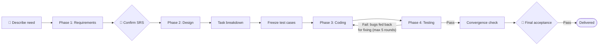

# SpecPilot 🛩️

[中文](README.md) | **English**

> A spec-driven, four-phase AI development pipeline: **AI runs the entire Requirements → Design → Coding → Testing flow, and humans step in at only two checkpoints — confirming requirements and final acceptance.**



## What's Inside

| Path | Content |
|------|---------|
| [.agents/skills/spec-pilot/](.agents/skills/spec-pilot/) | **The SpecPilot skill** — an executable pipeline for ZCode: `SKILL.md` main workflow + 6 numbered artifact templates (including the pre-coding frozen test-case template) + a coding checklist + a lightweight-change template |
| [orchestrator/](orchestrator/README.md) | **Thin orchestrator** — the mechanical layer: stage gates, circuit-breaker counting, and exit-code collection enforced by script (`gate`/`test`/`reset`), turning "real runs, max 5 rounds" from prompt promises into physical constraints; includes a self-verifying GitHub Actions workflow with a project CI template, and a container sandbox runner (no network, read-only root, project-dir-only mount) |
| [examples/todo-cli/](examples/todo-cli/) | **A real full-level run** — the complete artifact chain of a CLI todo app, from SRS to test report, with code and tests actually green (42/42 unit tests passing) |
| [design-rationale.md](design-rationale.md) | Design rationale: why it works this way, and the thinking behind key decisions (role separation, objective referee, circuit breaker) |
| [software-development-phases/](software-development-phases/) | Eight articles on the traditional software engineering lifecycle (feasibility → requirements → design → coding → testing → deployment → maintenance + supporting processes), with Mermaid diagrams. **Positioned as human-oriented background reading** — the pipeline itself does not read them; AI roles follow `SKILL.md` and its templates |

## Core Principles

1. **Documents are stage contracts**: each phase's output is the sole input of the next — SRS → design → task list → code → test report. Any change propagates down the document chain; editing code alone is never allowed.
2. **Role separation prevents self-confirmation**: test cases are reverse-generated from requirements and frozen *before* coding (without looking at the implementation), so the code AI writes is verified against "requirements only".
3. **CI is the objective referee**: build, lint, and unit tests must actually run and pass by exit code. The AI claiming "it's done" counts for nothing.
4. **Circuit breaker**: the defect-fixing loop runs at most 5 rounds; if it doesn't converge, it escalates to a human.
5. **Two human-owned checkpoints**: requirement confirmation (source of truth for business intent) and final acceptance (accountability).

The pipeline adopts mechanisms from three open-source frameworks, adapted:

- [GitHub Spec Kit](https://github.com/github/spec-kit): constitution, tasks breakdown, analyze (consistency check), converge
- [BMAD-METHOD](https://github.com/bmad-code-org/BMAD-METHOD): right-sizing (process scaling), retrospective after acceptance
- [OpenSpec](https://github.com/Fission-AI/OpenSpec): per-change artifact organization, incremental archiving

## Usage

Prerequisite: an AI coding tool that supports Agent Skills (this skill follows the ZCode convention).

```text
# Greenfield project
/spec-pilot Build a CLI todo app with CRUD and priority sorting

# Add a feature to an existing project (run inside the project)
/spec-pilot Add an Excel export feature to this project

# Small change (automatically takes the lightweight path)
/spec-pilot Fix: the list page crashes on special characters

# Fully automatic mode (skips the SRS confirmation checkpoint)
/spec-pilot Run fully automatically, don't ask me anything, build xxx
```

Natural-language triggers also work: "develop it automatically", "build xxx end-to-end with AI", "run SpecPilot".

After a run, the project keeps a complete artifact chain under `docs/`:

```
docs/
├── 00-constitution.md   # Project constraints (tech-stack boundaries, conventions, quality bar)
├── 01-srs.md            # Software requirements spec (use-case diagrams, flows, acceptance criteria)
├── 02-design.md         # Design doc (architecture, class, sequence, and E-R diagrams)
├── 03-tasks.md          # Task list (checked off one by one)
├── 04-test-cases.md     # Test cases (reverse-generated from requirements and frozen before coding)
├── 05-dev-doc.md        # Development doc (actual structure, deviations, run guide)
├── 06-test-report.md    # Test report (per-round results, defects, trends)
├── lessons.md           # Retrospective notes (appended after acceptance; read first on next run)
└── changes/<change>/    # Lightweight artifacts for post-delivery changes (spec.md + 04 + 06; merged back after completion)
```

Want to see what a real run looks like? See [examples/todo-cli/](examples/todo-cli/) — a one-line requirement ("a CLI todo app with CRUD and priority sorting") turned into 8 artifact documents plus working code, with 42/42 unit tests passing.

## Customization

When modifying the pipeline, follow the **three-layer placement** rule to keep rules from piling up and diluting execution:

1. **Judgment rules** (how to weigh trade-offs, when to escalate or exempt) → go in the [SKILL.md](.agents/skills/spec-pilot/SKILL.md) main text;
2. **Structural requirements** (required sections, columns, self-check items) → go down into the "artifact self-check" list of the corresponding template in `references/`;
3. **Mechanically checkable facts** (artifact existence, non-empty fields, checkbox state, exit codes, no gaps in coverage matrix) → go down into the [orchestrator](orchestrator/README.md) `gate`, enforced by script — never in prose.

Before adding any rule to SKILL.md, ask whether it can be pushed down to the lower two layers; review the main text length periodically.

## License

MIT
