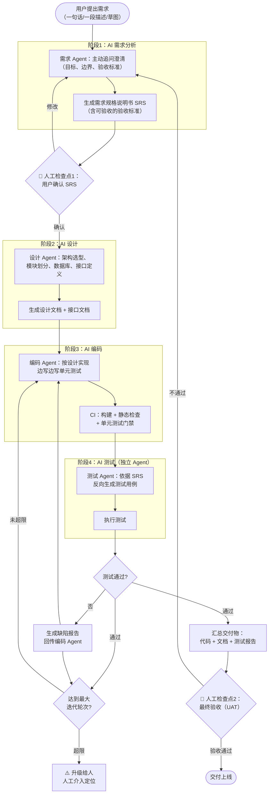
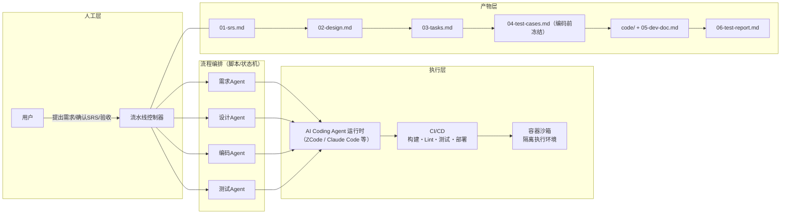

# AI 驱动的四阶段自动化开发流程

> 本流程的 skill 化实现名为 **SpecPilot**，位于 `.agents/skills/spec-pilot/`（ZCode 中用 `/spec-pilot` 或自然语言"自动开发"触发）。实现版在本文档基础上进一步吸收了 GitHub Spec Kit（constitution、任务拆解、一致性检查、收敛核对）、BMAD-METHOD（流程分级、验收后复盘）、OpenSpec（按变更组织产物）的机制，以 skill 内的 SKILL.md 为准。

## 1. 设计理念

传统流程中，四个阶段由**人**执行、靠**文档**在阶段间传递、每个阶段都要**人评审**。本方案把执行者换成 AI：

> **AI 执行全部阶段，人只在两个关键节点介入：需求确认 + 最终验收。**

核心判断依据是：四个阶段中，AI 能力最弱、最不能被替代的环节是"判断需求是否正确"（业务价值）和"判断交付是否合格"（验收责任）——这两件事涉及真实世界的意图和责任，必须有人签核；而设计、编码、测试执行的反复劳动，AI 已经可以承担。

| 阶段 | 传统模式 | 本方案 | 人工介入 |
|------|----------|--------|----------|
| 需求分析 | 人访谈、人写 SRS、人评审 | AI 对话澄清 + AI 生成 SRS + AI 自审 | ✅ **必须**：确认 SRS（唯一的需求"真值"来源） |
| 设计 | 人设计、人评审 | AI 生成架构/数据库/接口设计 + 独立子代理对抗式评审 | ❌ 无：评审靠 AI 角色分离承担，不占人工检查点 |
| 编码 | 人写代码、人 Code Review | AI 编码 + AI 评审 + CI 门禁 | ❌ 无 |
| 测试 | 人写用例、人执行、人回归 | AI 从需求生成用例 + 独立测试 Agent 执行 + 自动闭环 | ❌ 无（结果自动汇总给人） |
| 验收 | 人做 UAT | AI 汇总交付物与测试报告 | ✅ **必须**：人做最终验收签核 |

## 2. 全流程图

> 流程中只有 2 个菱形判断需要人，且都是必须的：**确认 SRS** 与 **最终验收**。其余全部自动循环（实现版 SKILL.md 已取消"抽查设计"可选检查点，设计、编码、测试不再请求中间审批）。

## 3. 四个 AI 角色的职责

每个阶段对应一个 Agent 角色，本质上是「角色提示词 + 输入规范 + 输出模板 + 自检清单」：

### 3.1 需求 Agent（AI 需求分析师）
- **输入**：用户的原始描述（可任意粗糙）
- **工作方式**：对话式——不臆测，主动追问关键信息（用户是谁、核心场景、不做什么、怎样算成功）
- **输出**：SRS，其中**验收标准必须可自动验证**（如"响应 ≤ 2 秒"而不是"快"），因为它是后面测试 Agent 的依据
- **自检**：每条需求无歧义、可测试、边界明确；缺失信息标记为"待确认"而不是编造

### 3.2 设计 Agent（AI 架构师）
- **输入**：确认后的 SRS
- **输出**：技术选型及理由、模块划分、数据库 Schema、接口文档、目录结构
- **自检**：逐条对照需求跟踪矩阵检查覆盖；遵循"满足需求前提下尽量简单"防止过度设计；定稿后由干净上下文的子代理做对抗式评审（角色分离延伸到设计——设计者自查覆盖，但评审必须换脑子）

### 3.3 编码 Agent（AI 开发）
- **输入**：设计文档 + 接口文档
- **工作方式**：小步实现，每个模块附带单元测试；发现设计不合理时**回传设计 Agent 更新文档**，而不是擅自偏离
- **输出**：通过 CI（构建 + Lint + 单元测试）的代码

### 3.4 测试 Agent（AI 测试，独立于编码 Agent）
- **输入**：**只有 SRS 和接口文档，不看代码实现**（防止照着实现写测试的自我认同）
- **工作方式**：从需求反向推导测试用例，重点覆盖边界值、异常输入、失败场景；自动执行并出报告
- **输出**：测试用例集、执行结果、缺陷报告（复现步骤 + 期望/实际）

## 4. 关键设计决策

### 4.1 为什么"角色分离"是生命线
写代码的 AI 和测代码的 AI 必须是**两个独立上下文**：
- 测试 Agent 的用例来源是**需求**，不是代码——这样测试才是对需求的验证，而不是对实现的复述；
- 缺陷报告由测试 Agent 以"用户视角"书写，编码 Agent 拿到的是客观证据而非内部信息。

### 4.2 为什么验收标准必须"可自动验证"
需求 Agent 在写 SRS 时就要为每条需求写验收标准，测试 Agent 直接把验收标准翻译成测试用例。这样"需求 → 测试"形成一条机器可执行的链，这是整个流程能自动闭环的前提。

### 4.3 为什么要"最大迭代轮次"熔断
测试不过 → 修复 → 重测的循环可能不收敛（AI 在两个错误方案之间摇摆）。设置最大轮次上限（SpecPilot 实现为 5 轮），超限即升级给人，并附上全部迭代历史供定位。

### 4.4 人保留的两个节点的意义
- **确认 SRS**：这是用户意图进入系统的唯一入口。SRS 错，后面 AI 执行得再完美也是南辕北辙。所以这个检查点不能省，且 SRS 必须是"人能看懂的自然语言 + 原型"（有 UI 项目的原型落点即模板 3.2 界面与交互节：页面清单、流转图、关键交互反馈）。
- **最终验收**：法律责任与信任问题——交付物对外的责任主体只能是人。

## 5. 落地方案（用现有工具即可搭建）

搭建要点：

> **落地进度（2026-09）**：§5 四个要点均已首版落地——要点 1 即 `.agents/skills/spec-pilot/` 中的 SKILL 与模板；要点 2 首版薄编排器（[orchestrator/specpilot.py](orchestrator/specpilot.py)：`gate`/`test`/`reset`，阶段门禁、熔断计数、退出码采集由脚本强制）；要点 3 首版容器沙箱（`orchestrator/Dockerfile` + `sandbox.sh`：无网络、只读根文件系统、仅挂载项目目录、非特权，自证 CI 含沙箱作业与网络不可达断言）；要点 4 首版 CI 产结果（`.github/workflows/ci.yml` 自证绿灯 + `orchestrator/ci-templates/` 项目模板 + 运行留痕 `source` 字段）。残余增强：报告数字从 CI 系统自动拉取生成、远程托管沙箱服务。

1. **每个 Agent = 一个角色化提示词 + 前述各阶段文档作为工作规范**（`02-requirements.md` 就是需求 Agent 的规范，以此类推），输出严格套用产出物模板。
2. **编排器**只是一个状态机脚本（shell/Python 均可）：按阶段调用 Agent 运行时，检查产出物存在且通过自检清单，再进入下一阶段；测试循环和熔断计数也在这里实现。
3. **执行环境用容器沙箱**：AI 生成的代码自动执行（构建、测试），必须隔离运行，限制网络与文件系统权限。
4. **CI 作为客观裁判**：单元测试、Lint、安全扫描的结果由 CI 产出，不由 Agent 自行宣称——Agent 说"我做完了"不算数，流水线绿灯才算数。

## 6. 边界与风险

| 风险 | 说明 | 对策 |
|------|------|------|
| 需求理解偏差 | AI 把模糊表述理解成另一种东西，且越往下走偏得越远 | SRS 强制用户确认；演示可运行版本让用户"眼见为实" |
| AI 自我认同 | 写代码与测代码的 AI 互相"配合演出" | 角色分离 + 测试用例只源于需求 + CI 客观结果 |
| 不收敛循环 | 缺陷修复互相打转 | 最大迭代轮次熔断 + 升级人工 |
| 安全与合规 | AI 生成代码可能引入漏洞或侵权依赖 | CI 强制安全扫描与依赖审计；沙箱隔离执行 |
| 责任真空 | 出了事故找不到责任人 | 明确人是最终权责主体；全程留痕（每阶段产物可追溯） |

## 7. 一句话总结

> **人负责"说要什么"和"确认收到了"，AI 负责"想清楚、做出来、测明白"——流程自动化靠的是：文档化的阶段契约 + 角色分离的 Agent + CI 作为客观裁判 + 熔断机制兜底。**
