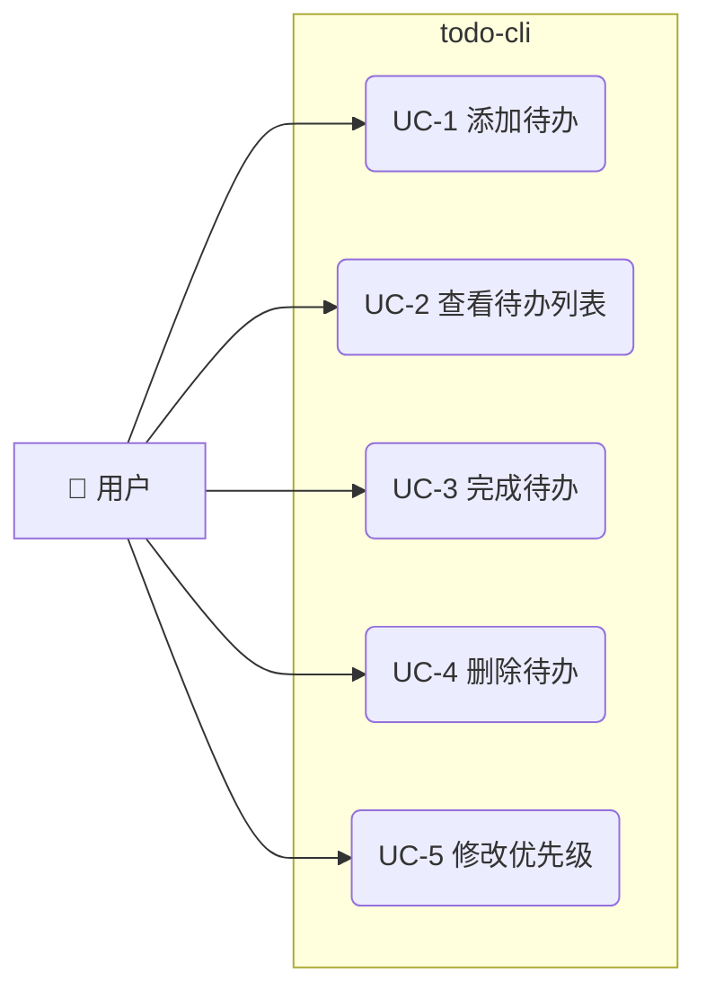
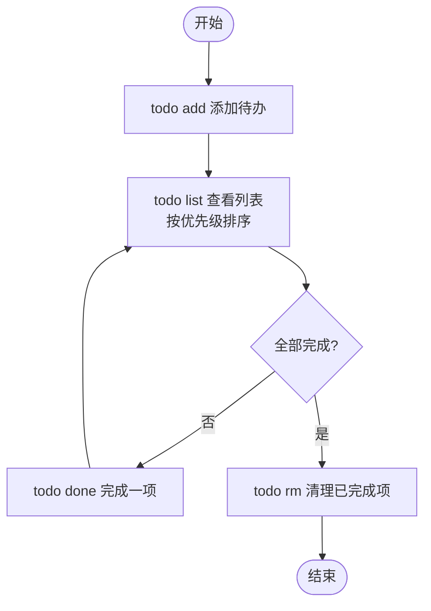

# 需求规格说明书（SRS）—— 命令行待办事项工具

> 产生于阶段 1，已获用户确认（完整级运行）。示例运行说明：本文件演示流水线"从一句话到产物链"的标准形态。

## 1. 项目概述

- **项目名称**：todo-cli
- **一句话描述**：一个零依赖的命令行待办事项工具，支持增删改查与优先级排序。
- **目标用户**：习惯终端操作的程序员与重度命令行用户。
- **要解决的核心问题**：轻量任务管理——不想为一个待办清单打开浏览器或安装依赖。

## 2. 参与者与用例

### 2.1 参与者（Actor）

| 参与者 | 说明 |
|--------|------|
| 用户 | 通过命令行管理自己的待办事项 |

（单用户本地工具，无管理员与外部系统。）

### 2.2 用例图

### 2.3 核心用例描述

| 项 | UC-1 添加待办 |
|----|--------------|
| 用例编号 | UC-1 |
| 用例名称 | 添加待办 |
| 参与者 | 用户 |
| 前置条件 | 无 |
| 主流程 | 1. 用户执行 `todo add "写周报" -p high` 2. 系统创建 ID=1 的待办 3. 终端输出 `已添加：#1 [高] 写周报` |
| 扩展流程 | 1a. 内容为空 → 输出错误提示，退出码 2；1b. 优先级非法（非 high/normal/low）→ 错误提示，退出码 2 |
| 后置条件 | 新待办已持久化 |

| 项 | UC-2 查看待办列表 |
|----|------------------|
| 用例编号 | UC-2 |
| 用例名称 | 查看待办列表 |
| 参与者 | 用户 |
| 前置条件 | 无（空列表也有效） |
| 主流程 | 1. 用户执行 `todo list` 2. 系统按"未完成在前、按优先级 high>normal>low、同级按 ID 升序"输出全部待办，每行格式 `#ID [优先级] 内容`，已完成项以 `[x]` 标注 |
| 扩展流程 | 1a. 列表为空 → 输出 `暂无待办`，退出码 0 |
| 后置条件 | 无（只读） |

| 项 | UC-3 完成待办 |
|----|--------------|
| 用例编号 | UC-3 |
| 用例名称 | 完成待办 |
| 参与者 | 用户 |
| 前置条件 | 待办存在且未完成 |
| 主流程 | 1. 用户执行 `todo done 3` 2. 系统将 #3 标记为已完成 3. 输出 `已完成：#3` |
| 扩展流程 | 1a. ID 不存在 → 错误提示，退出码 1；1b. 已是完成状态 → 错误提示，退出码 1 |
| 后置条件 | 完成状态已持久化 |

| 项 | UC-4 删除待办 |
|----|--------------|
| 用例编号 | UC-4 |
| 用例名称 | 删除待办 |
| 参与者 | 用户 |
| 前置条件 | 待办存在 |
| 主流程 | 1. 用户执行 `todo rm 2` 2. 系统删除 #2 3. 输出 `已删除：#2` |
| 扩展流程 | 1a. ID 不存在 → 错误提示，退出码 1 |
| 后置条件 | 删除已持久化 |

| 项 | UC-5 修改优先级 |
|----|----------------|
| 用例编号 | UC-5 |
| 用例名称 | 修改优先级 |
| 参与者 | 用户 |
| 前置条件 | 待办存在 |
| 主流程 | 1. 用户执行 `todo pri 3 low` 2. 系统将 #3 优先级改为 low 3. 输出 `已修改优先级：#3 → 低` |
| 扩展流程 | 1a. ID 不存在 → 错误提示，退出码 1；1b. 优先级非法 → 错误提示，退出码 2 |
| 后置条件 | 优先级已持久化 |

## 3. 业务流程图

核心端到端流程（添加 → 排序展示 → 完成退出）：

## 4. 功能需求

| 编号 | 需求描述 | 关联用例 | 优先级 | 验收标准（可自动验证） |
|------|----------|----------|--------|------------------------|
| FR-1 | 添加待办：内容 + 可选优先级（默认 normal） | UC-1 | 必须 | `add "内容" -p high` 后 `list` 输出含 `#1 [高] 内容`；空内容时退出码 2 且 stderr 有提示；非法优先级退出码 2 |
| FR-2 | 列表按优先级排序：未完成在前，high>normal>low，同级按 ID 升序 | UC-2 | 必须 | 依序添加 low/normal/high 三条后 `list` 的三行顺序为 high、normal、low 对应内容；退出码 0 |
| FR-3 | 完成待办：标记完成状态，`list` 中显示 `[x]` 且排在未完成之后 | UC-3 | 必须 | `done <id>` 后 `list` 该行含 `[x]`；对不存在 ID 退出码 1；重复完成退出码 1 |
| FR-4 | 删除待办 | UC-4 | 必须 | `rm <id>` 后 `list` 不再含该 ID；对不存在 ID 退出码 1 |
| FR-5 | 修改优先级：`pri <id> <优先级>` | UC-5 | 必须 | `pri <id> high` 后 `list` 该行含 `[高]`；非法优先级退出码 2；不存在 ID 退出码 1 |
| FR-6 | 数据持久化到 JSON 文件，路径可用环境变量 `TODO_FILE` 覆盖 | UC-1~5 | 必须 | 写操作后文件存在且为合法 JSON；设置 `TODO_FILE=/tmp/x.json` 后读写均落在该文件 |

## 5. 非功能需求

| 编号 | 类别 | 要求 | 验证方式 |
|------|------|------|----------|
| NFR-1 | 性能 | 100 条待办时 `list` 命令端到端执行 ≤ 0.5 秒 | 生成 100 条数据后用 `time` 测量真实执行耗时 |
| NFR-2 | 兼容性 | 在 Python 3.10+ / macOS、Linux 上运行 | 用 CI 矩阵或本机当前版本真实执行验证（本环境为 Python 3.13 / macOS） |
| NFR-3 | 可维护性 | 零第三方依赖，`python -m unittest` 开箱即跑 | 检查 import 语句无第三方模块；全新目录运行测试 |

## 6. 系统边界

- **本期不做**：多用户、日期/截止时间提醒、子任务、Web 界面
- **外部依赖**：无（仅 Python 标准库）

## 7. 待确认问题

| # | 问题 | 影响 | 状态 |
|---|------|------|------|
| 1 | 优先级是否需要三档之外的自定义权重？ | 数据结构 | 已确认：三档（high/normal/low）足够 |

## 8. 需求变更记录

| 日期 | 变更内容 | 提出方 | 原因 |
|------|----------|--------|------|
| 2026-09-13 | 初版基线 | 用户 | 示例运行 |

> 示例运行说明：本表用于演示变更记录机制，运行期间无新变更。
