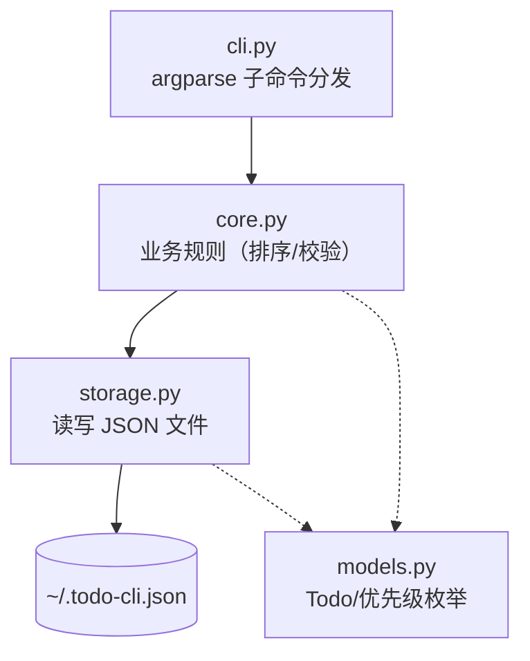
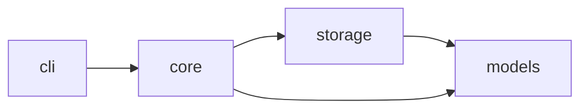
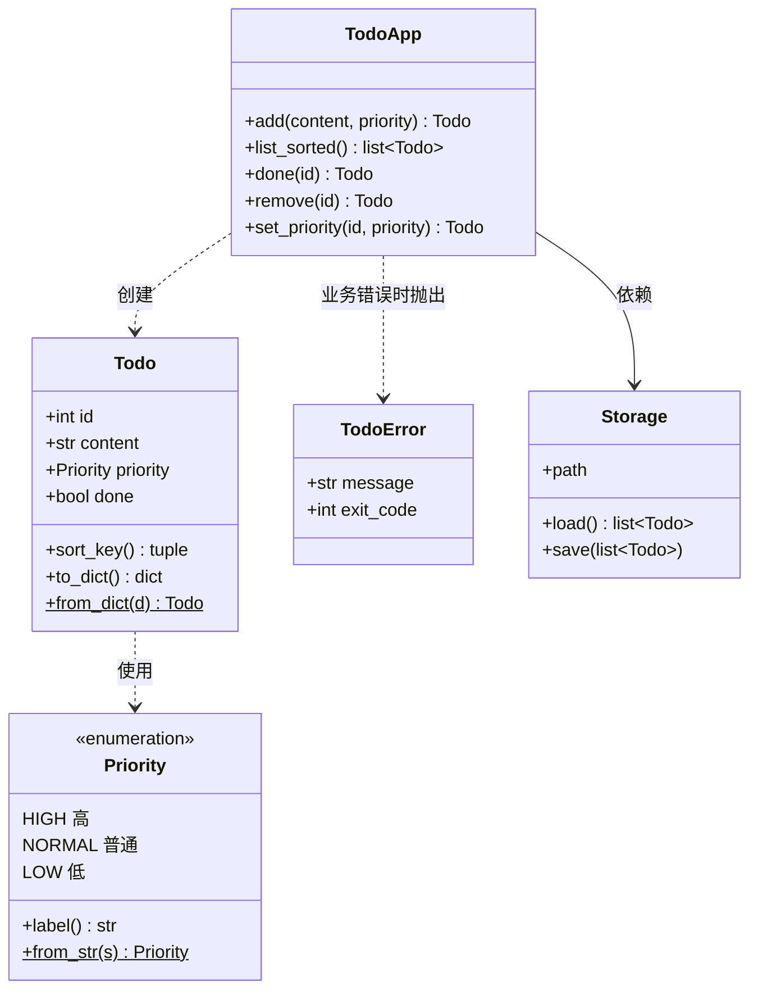
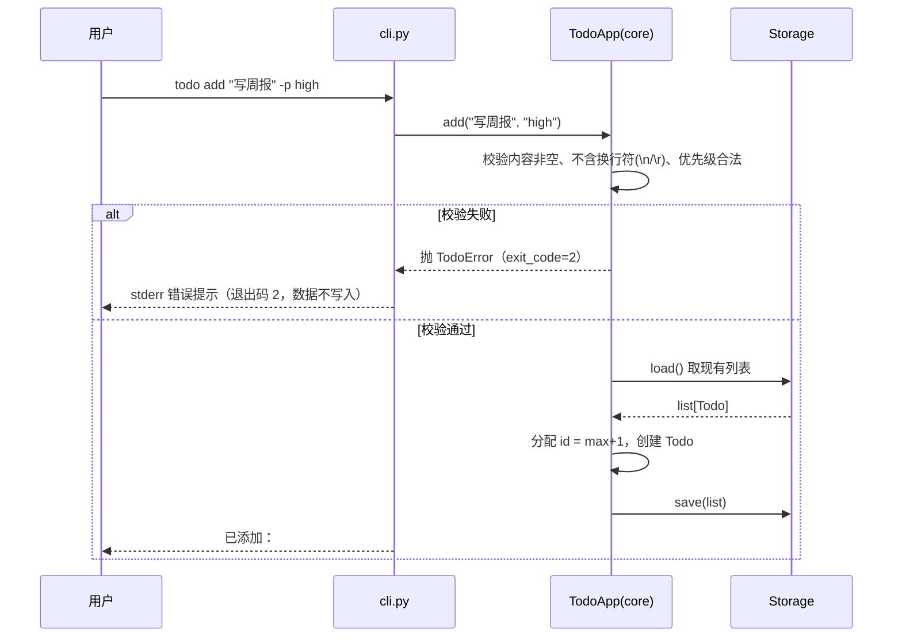
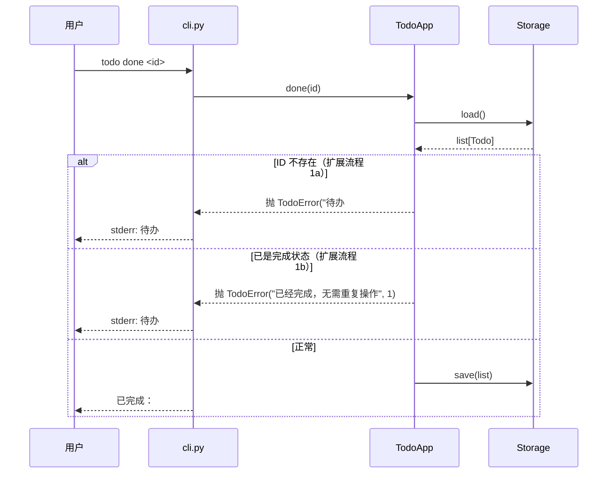
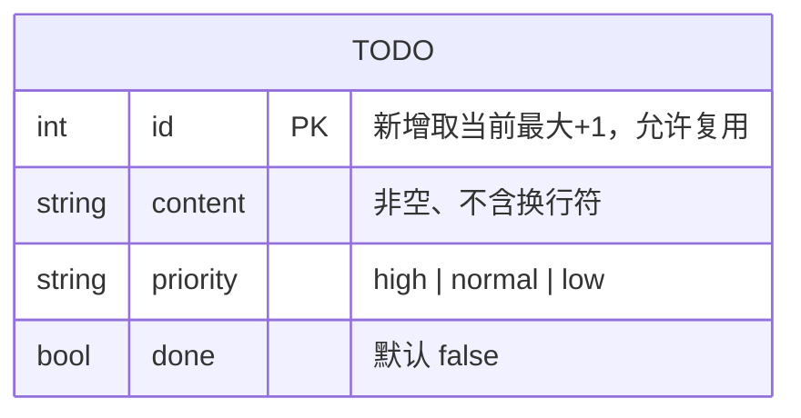
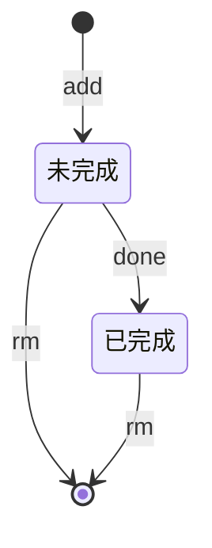

# 设计文档 —— 命令行待办事项工具

> 产生于阶段 2。以 docs/01-srs.md 为唯一输入。

## 1. 技术选型

| 层面 | 选择 | 理由 |
|------|------|------|
| 语言/框架 | Python 3.10+ 标准库（argparse、json、pathlib） | 零依赖满足 NFR-3；argparse 处理子命令与选项足够 |
| 数据库 | 无。单文件 JSON（`~/.todo-cli.json`，`TODO_FILE` 环境变量覆盖） | 待办量级小，JSON 可读可手改，符合 00-constitution 技术栈边界 |
| 主要依赖 | 无 | 同上 |

## 2. 系统架构图



> 图中箭头一律为"依赖方向"（与第 3 节模块依赖图同语义）。

## 3. 模块划分

| 模块 | 职责 | 对应需求 |
|------|------|----------|
| models | Todo 数据结构、优先级枚举与中文标签映射 | FR-1、FR-5 |
| storage | JSON 文件的读、写、原子保存（临时文件+rename） | FR-6 |
| core | 业务规则：添加/完成/删除/改优先级，校验与错误 | FR-1~FR-5 |
| cli | 命令行解析、输出格式、退出码映射 | FR-1~FR-5 |

模块间依赖关系（单向，右端不依赖左端）：



## 4. 核心类图



> TodoApp 各变更方法（add/done/remove/set_priority）返回被操作的 Todo，供单元测试断言使用；CLI 层不消费返回值，仅打印确认文案。

## 5. 关键流程时序图

UC-1 添加待办（含校验失败分支）：



UC-3 完成待办（覆盖主流程与全部扩展流程）：



## 6. 数据库设计

无数据库。JSON 文件结构（E-R 等价物）：



文件格式明细：

| 字段 | 类型 | 约束 | 说明 |
|------|------|------|------|
| 顶层 | 数组 | —— | `[Todo, ...]` |
| `id` | int | >0，新增取当前最大 id+1（空表取 1） | 删除后 id 允许复用（下次新增可能取回）；`rm`/`done` 以当前列表中的 id 为目标 |
| `content` | str | 非空字符串，不含换行符（`\n`/`\r`） | fix-newline-content 变更合入 |
| `priority` | str | ∈ {high, normal, low} | |
| `done` | bool | —— | |

文件不存在时视为空列表；文件损坏（非法 JSON）时抛 `TodoError`（退出码 1），不静默清空用户数据。

> 迁移策略：不涉及——新建项目、无既有数据；日后 JSON 结构若有变更，按设计模板要求在此补迁移脚本、兼容方式与回退处理。

## 7. 状态图（可选）

待办对象状态流转：



## 8. 非功能性设计

| 需求编号 | 类别 | 设计对策 |
|----------|------|----------|
| NFR-1 | 性能 | 全量加载 + 内存排序（O(n log n)），100 条量级毫秒级完成；JSON 单文件读写，无外部 I/O 等待 |
| NFR-2 | 兼容性 | 仅用 3.10+ 稳定标准库特性（pathlib、dataclass、enum），无平台特定调用；路径用 pathlib 跨平台展开 `~` |
| NFR-3 | 可维护性 | 分层单向依赖、零第三方 import；unittest + tempfile 隔离测试环境 |

## 9. 接口定义

对 CLI 工具，"接口"即子命令。退出码：`0` 成功、`1` 业务错误、`2` 用法错误（00-constitution 已约定）。

| 接口 | 方法 | 路径/签名 | 入参 | 出参 | 错误码 |
|------|------|-----------|------|------|--------|
| add | 子命令 | `add CONTENT [-p PRIORITY]` | 内容、可选优先级 | `已添加：#N [标签] 内容` | 2：空内容/含换行符/非法优先级 |
| list | 子命令 | `list` | 无 | 每行 `#ID [标签] 内容`，已完成为 `[x] #ID [标签] 内容`，空表 `暂无待办` | —— |
| done | 子命令 | `done ID` | 待办 ID | `已完成：#ID` | 1：不存在/已完成 |
| rm | 子命令 | `rm ID` | 待办 ID | `已删除：#ID` | 1：不存在 |
| pri | 子命令 | `pri ID PRIORITY` | 待办 ID、优先级 | `已修改优先级：#ID → 标签` | 1：不存在；2：非法优先级（优先级先校验：ID 与优先级均非法时返回 2） |

统一规则：所有子命令读取数据文件遇到损坏/不可读 JSON 时抛 `TodoError`（退出码 1），接口表不再逐行重复。

退出码语义边界：参数类校验（空内容、含换行、非法优先级）在业务层 `TodoApp` 执行，但性质属"用法错误"，由 `TodoError` 携带 `exit_code=2` 表达——退出码的分类依据是**错误的性质**（用法 vs 业务），不是校验发生的层；argparse 仅做类型转换（ID 传非整数时由 argparse 自行以退出码 2 拒绝）。

调用示例（含失败场景）：

```bash
$ todo add "写周报" -p high
已添加：#1 [高] 写周报          # 退出码 0

$ todo done 99
待办 #99 不存在                  # 退出码 1（业务错误，stderr）
```

## 10. 目标目录结构

```
todo-cli/
├── todo/                 # 包：实现代码
│   ├── __init__.py
│   ├── models.py        # Todo、Priority、TodoError
│   ├── storage.py       # Storage：JSON 读写
│   ├── core.py          # TodoApp：业务规则
│   └── cli.py           # 入口：argparse 分发与退出码
├── tests/                # 单元测试
│   ├── __init__.py
│   ├── test_models.py
│   ├── test_storage.py
│   ├── test_core.py
│   └── test_cli.py
├── todo.py               # 启动脚本：python3 todo.py <子命令>（与包同名但仅作脚本执行，无遮蔽影响；正式分发建议改 console-script 入口）
└── docs/                 # 本产物链
```

## 11. 设计变更记录

| 日期 | 变更内容 | 原因 | 关联需求 |
|------|----------|------|----------|
| 2026-09-13 | 初版设计 | —— | 全部 |
| 2026-09-13 | 合入 fix-newline-content：add 校验内容不含换行符（`\n`/`\r`），退出码 2 且数据不写入——同步至 UC-1 时序图、接口表、content 约束（此前漏同步，对抗式评审发现） | SRS 已合入变更沿链传播 | FR-1 |
| 2026-09-19 | v1.0 对抗式设计评审（干净上下文子代理，输入仅 SRS + 设计）：12 项发现全部处置——11 项采纳修订本文（id 规则改为"允许复用"并与 max+1 分配一致、删除 ER 图残留字段 next_id_seq、架构图依赖方向与第 3 节统一、接口表补文件损坏错误码与 pri 校验顺序、退出码语义边界说明、UC-1/UC-3 时序图补异常分支与参与者声明、入口机制澄清、返回值用途说明）；1 项不采纳：启动脚本改名（与包同名仅脚本执行场景无遮蔽影响，示例从简，正式分发建议 console-script） | 对抗式评审 | 全部 |

## 12. 需求覆盖对照表

| 需求编号 | 需求摘要 | 由哪些模块/接口实现 |
|----------|----------|---------------------|
| FR-1 | 添加待办 | core.TodoApp.add + cli add 子命令 |
| FR-2 | 优先级排序列表 | models.Todo.sort_key + core.list_sorted + cli list |
| FR-3 | 完成待办 | core.TodoApp.done + cli done |
| FR-4 | 删除待办 | core.TodoApp.remove + cli rm |
| FR-5 | 修改优先级 | core.TodoApp.set_priority + cli pri |
| FR-6 | JSON 持久化 + TODO_FILE | storage.Storage（构造时读环境变量） |
| NFR-1 | list ≤ 0.5s @100 条 | 全量内存排序，无索引额外开销 |
| NFR-2 | Python 3.10+ 跨平台 | 仅稳定标准库 + pathlib |
| NFR-3 | 零依赖开箱即跑 | 分层设计 + unittest |

## 13. 产出物自检

- [x] 覆盖对照表无缺口：每条 FR/NFR 都有设计落点
- [x] 每个关键用例至少对应一张时序图（UC-1、UC-3 各一张）
- [x] 每条 NFR 都有设计对策
- [x] 技术选型有理由，未引入需求之外的技术组件（零第三方依赖）
- [x] 架构图、类图、时序图、数据设计齐全且与文字描述一致
