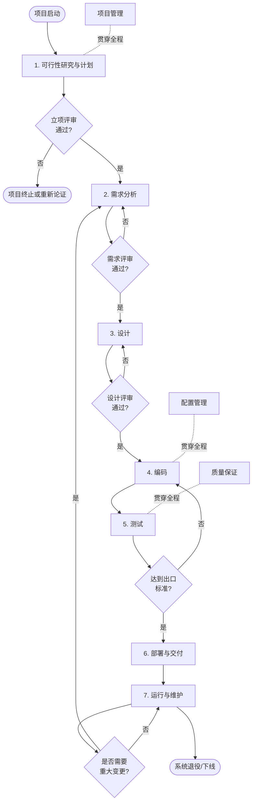
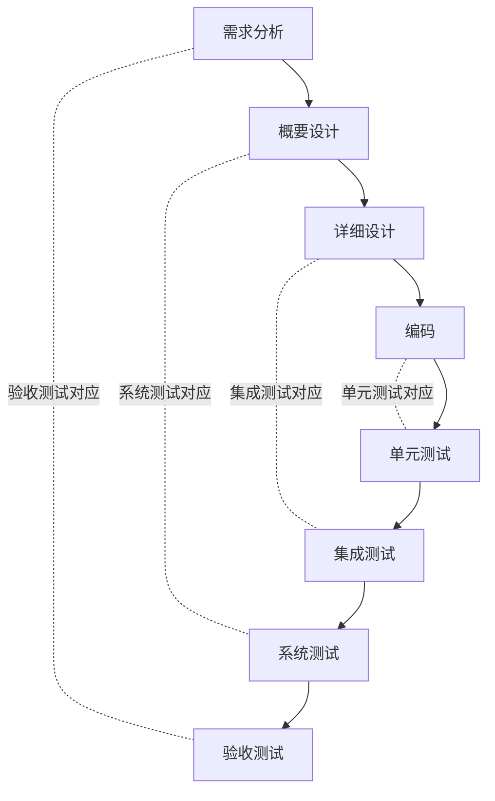
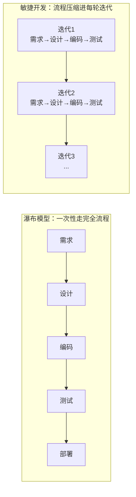

# 软件工程流程总览

一个完整的软件工程项目，从"要不要做"到"上线后持续维护"，通常经历 **7 个阶段**，并由若干**支持性过程**贯穿始终。本目录为每个阶段提供一份详细文档。

## 全流程图

> 上图体现了软件工程的两个核心特征：**每个阶段结束时都有评审把关**（不通过则回到本阶段修正），以及**流程可以迭代循环**（维护阶段发现的需求可以开启新一轮"需求→设计→编码→测试"循环）。

## 阶段一览

| # | 阶段 | 英文 | 核心问题 | 主要产出物 | 结束标志 |
|---|------|------|----------|------------|----------|
| 1 | 可行性研究与计划 | Feasibility Study & Planning | 要不要做？能不能做成？ | 可行性研究报告、项目计划书 | 立项评审通过 |
| 2 | 需求分析 | Requirements Analysis | 系统要**做什么**？ | 需求规格说明书（SRS） | 需求评审通过，基线冻结 |
| 3 | 设计 | Design | 系统**怎么做**？ | 概要/详细设计说明书、数据库与接口文档 | 设计评审通过 |
| 4 | 编码 | Coding / Implementation | 把方案**变成代码** | 源代码、单元测试 | 单元测试通过、代码评审完成 |
| 5 | 测试 | Testing | 程序**对不对**？ | 测试计划、用例、缺陷报告、测试报告 | 缺陷收敛，达到出口标准 |
| 6 | 部署与交付 | Deployment & Delivery | 如何**安全上线**？ | 部署方案、用户手册、培训记录 | 验收签字，系统稳定运行 |
| 7 | 运行与维护 | Operation & Maintenance | 如何**持续创造价值**？ | 变更单、版本发布说明、维护记录 | 直至系统退役下线 |

## 各阶段文档

1. [01-feasibility.md](01-feasibility.md) —— 可行性研究与计划
2. [02-requirements.md](02-requirements.md) —— 需求分析
3. [03-design.md](03-design.md) —— 设计
4. [04-coding.md](04-coding.md) —— 编码
5. [05-testing.md](05-testing.md) —— 测试
6. [06-deployment.md](06-deployment.md) —— 部署与交付
7. [07-maintenance.md](07-maintenance.md) —— 运行与维护
8. [08-support.md](08-support.md) —— 支持性过程（项目管理、配置管理、质量保证）

## V 模型：设计与测试的对应关系

测试不是孤立的最后一步，它与前面的阶段一一对应：

每一层设计和它对应的测试级别描述的是同一件事：左侧是"构建"的视角，右侧是"验证"的视角。

## 支持性过程

以下活动不属于某个具体阶段，而是**贯穿整个生命周期**（详见 [08-support.md](08-support.md)）：

| 活动 | 内容 |
|------|------|
| 项目管理 | 范围、进度、成本、风险、人员的管理 |
| 配置管理 | 版本控制、基线管理、变更控制 |
| 质量保证（QA） | 过程规范、阶段评审、审计 |
| 文档管理 | 各阶段产出物的编写、评审、归档 |
| 风险管理 | 风险识别、评估、应对与监控 |

## 开发模型：阶段的组织方式

同样这 7 个阶段，在不同开发模型中的组织方式不同：

| 模型 | 特点 | 适用场景 |
|------|------|----------|
| 瀑布模型 | 阶段严格串行，文档驱动 | 需求明确且稳定的项目（如军工、金融核心系统） |
| 增量/迭代模型 | 分批交付，逐步完善 | 需求可以分期的中大型项目 |
| V 模型 | 强调测试与设计层层对应 | 对质量要求极高、需要完整验证链的项目 |
| 敏捷开发（Scrum 等） | 2~4 周一轮迭代，快速响应变化 | 需求多变、强调快速交付价值的互联网项目 |

**实践建议**：阶段划分是"思维的框架"而不是"流程的枷锁"。无论采用哪种模型，"先想清楚做什么（需求），再想清楚怎么做（设计），做完要验证（测试）"这个顺序不能颠倒，改变的只是每轮循环的大小和文档的轻重。
