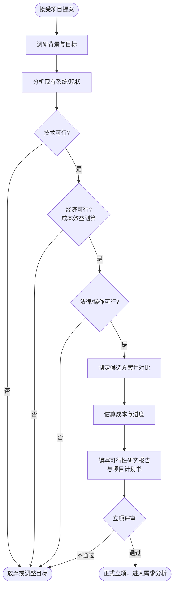

# 可行性研究与计划（Feasibility Study & Planning）

## 阶段定位

可行性研究回答的问题是：**这个项目要不要做？能不能做成？**

这是整个生命周期的起点。在投入大量人力物力之前，先对项目做一次全面的论证：技术上是否可行、经济上是否划算、法律上是否合规、团队是否有能力运营。论证通过后才正式立项。

## 主要工作

### 1. 项目背景与目标分析
- 搞清楚要解决的问题是什么、为谁解决
- 明确项目目标和成功标准（可衡量的）

### 2. 可行性论证

| 维度 | 要回答的问题 |
|------|--------------|
| 技术可行性 | 现有技术能否实现？团队是否掌握所需技术？有没有技术难点和风险？ |
| 经济可行性 | 开发成本多少？预期收益多少？投资回收期多长？（成本-效益分析） |
| 操作可行性 | 目标用户能否接受新的工作方式？组织是否具备运行条件？ |
| 法律/社会可行性 | 是否涉及专利、数据合规（如个人信息保护）、行业监管要求？ |
| 进度可行性 | 在要求的期限内完成的现实性有多大？ |

### 3. 方案比较
- 通常提出 2~3 种候选方案（含"不开发，维持现状"），逐一论证并对比
- 推荐一个方案并说明理由

### 4. 成本与进度估算
- 估算工作量（人月）、开发周期、软硬件投入
- 制定初步的里程碑计划

### 5. 制定项目计划
- 确定团队组织结构、人员分工
- 识别主要风险及初步应对措施
- 规划后续各阶段的大致时间表

## 流程图

## 产出物

| 产出物 | 内容 |
|--------|------|
| 可行性研究报告 | 背景、候选方案、各维度可行性论证、结论与建议 |
| 项目计划书 | 目标、范围、里程碑计划、资源与预算、组织分工、初步风险清单 |
| 成本效益分析 | 开发成本、运行成本、预期收益、投资回收期 |

## 结束标志

- 可行性研究报告和项目计划书评审通过，正式立项
- 关键干系人（出资方、业务方、技术负责人）对目标和范围达成一致

## 常见问题与建议

- **先有结论再找依据**：为了立项而立项，可行性论证流于形式。应允许"论证不通过"这个结论存在，及时止损比勉强上马更划算。
- **低估成本、高估收益**：估算时只算开发成本，忽略运维、升级、人员培训等长期成本。建议按项目全生命周期估算。
- **目标不可衡量**："提升用户体验"不是目标，"核心流程操作步骤从 8 步减到 3 步"才是。
- **忽视非技术因素**：技术上可行不等于项目能成功，组织意愿、用户习惯、合规要求同样可能让项目失败。
