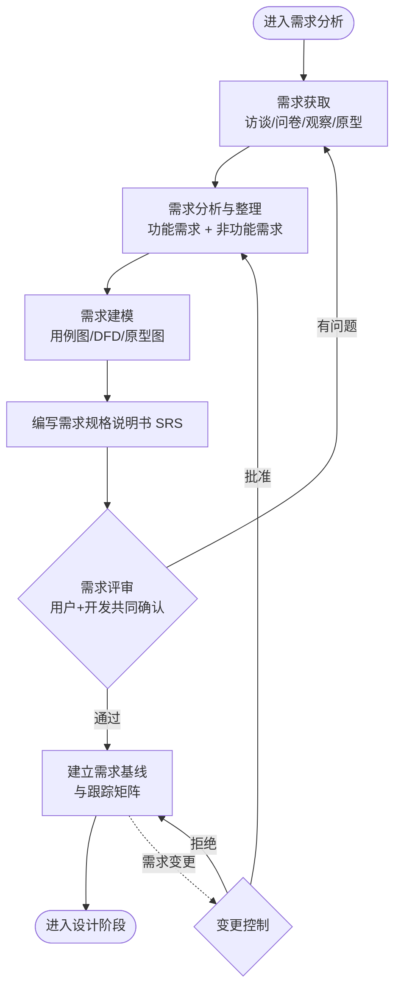

# 需求分析（Requirements Analysis）

## 阶段定位

需求分析回答的问题是：**系统要做什么？**

这是立项之后的第一项正式工程活动，决定了后续所有工作的方向。它只关注"做什么"，不涉及"怎么做"——技术方案是设计阶段的事。需求阶段的问题是后面所有问题的源头：有统计表明，超过一半的项目缺陷可以追溯到需求阶段。

## 主要工作

### 1. 需求获取
- 与用户、客户、业务方沟通：访谈、问卷、现场观察、原型演示、竞品分析
- 收集业务背景、目标用户、使用场景
- 研究现有系统或人工流程

### 2. 需求分析与整理
- **功能需求**：系统必须具备的功能，如"用户可以在线下单"
- **非功能需求**：质量属性约束，如：

  | 类别 | 示例 |
  |------|------|
  | 性能 | 查询响应时间 ≤ 2 秒（95% 分位），支持 1000 并发 |
  | 安全性 | 认证、授权、敏感数据加密、操作审计 |
  | 可用性 | 全年可用率 ≥ 99.9%，故障恢复 ≤ 30 分钟 |
  | 可维护性/可扩展性 | 新增报表类型不需要修改核心代码 |
  | 兼容性 | 支持主流浏览器和移动端 |

- 区分**需求**（用户要解决的问题）和**方案**（实现手段），避免过早锁定技术细节
- 明确系统边界：哪些在系统内做，哪些不做；与外部系统的交互界面在哪

### 3. 需求建模
- **结构化方法**：数据流图（DFD）、数据字典、E-R 图
- **面向对象方法**：用例图、类图、时序图、状态图
- **轻量方法**：用户故事（作为……我希望……以便……）、验收标准、界面原型

### 4. 需求确认
- 与用户逐条确认，消除歧义，形成双方一致的理解
- 排定优先级（如 MoSCoW 法：必须有 / 应该有 / 可以有 / 暂不做）

### 5. 需求管理（持续活动）
- 需求基线化，后续变更走正式的变更控制流程
- 建立需求跟踪矩阵，保证每条需求都能追溯到设计、代码和测试用例

## 流程图

## 产出物

| 产出物 | 内容 |
|--------|------|
| 需求规格说明书（SRS） | 完整、无歧义的功能与非功能需求描述 |
| 用例文档 / 用户故事 | 各角色的使用场景和预期结果 |
| 原型图 | 界面交互的初步示意，辅助沟通 |
| 需求跟踪矩阵 | 需求条目编号及其与设计、测试的对应关系 |

## 结束标志

- 需求评审通过（用户方和开发方共同确认）
- 需求基线冻结，后续变更走变更管理流程

## 常见问题与建议

- **需求含糊**："系统要快、要好用"无法验收，应量化为"查询响应时间 ≤ 2 秒"。
- **需求蔓延（Scope Creep）**：开发过程中不断加需求，应通过变更控制评估对成本和进度的影响后再决定。
- **只记录了方案没记录需求**：用户说"我要一个下拉框"，背后的真实需求可能是"快速筛选订单"。应记录真实意图，方案可以在设计时再优化。
- **用户"不知道自己要什么"**：用原型和迭代演示代替纯文字沟通，让用户看到实物后再反馈。
- **忽略非功能需求**：只写功能清单，性能、安全、可用性等到测试甚至上线后才发现不达标。
