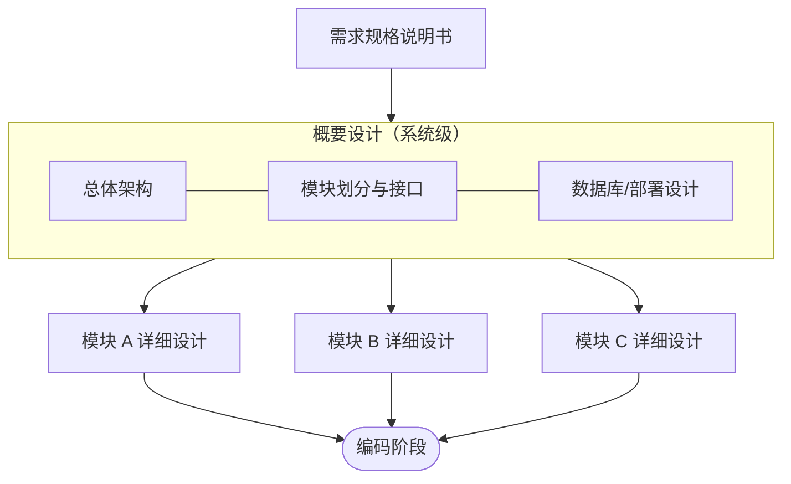

# 设计（Design）

## 阶段定位

设计回答的问题是：**系统怎么做？**

设计阶段把需求规格说明书（"做什么"）转化为可实现的技术方案（"怎么做"），是需求与编码之间的桥梁。设计分为两个层次：**概要设计**（系统级）和**详细设计**（模块级）。

## 主要工作

### 1. 概要设计（架构设计）
站在系统全局，确定整体结构：

- **架构选型**：单体 / 微服务、前后端分离、消息队列等技术选型
- **模块划分**：把系统拆成职责清晰、低耦合高内聚的模块
- **接口定义**：模块之间、系统之间的调用方式和数据格式
- **数据库设计**：表结构、E-R 模型、索引策略、数据量估算
- **部署架构**：服务器、网络、负载均衡、容灾方案
- **关键技术决策**：缓存策略、事务处理、安全方案等，并记录决策理由

### 2. 详细设计
针对每个模块，细化到可以直接编码的程度：

- 类和函数的设计（职责、方法签名、类之间的关系）
- 核心算法和业务流程（流程图、时序图、状态图）
- 接口的详细定义（参数、返回值、错误码、调用示例）
- 异常处理和边界条件的处理方式
- 日志、监控、配置的处理约定

### 3. 用户界面设计
- 交互流程、页面布局、视觉规范（可与详细设计并行）
- 保证与需求阶段的原型一致

### 4. 设计评审
- 组织开发、测试等相关人员评审
- 检查方案是否覆盖全部需求、是否可扩展、是否存在技术风险

## 层次关系

> 概要设计回答"系统分成几块、块之间怎么连接"，详细设计回答"每一块内部怎么实现"。

## 产出物

| 产出物 | 内容 |
|--------|------|
| 概要设计说明书 | 架构图、模块划分、模块间接口、技术选型理由 |
| 详细设计说明书 | 每个模块的类/函数设计、流程图、时序图 |
| 数据库设计文档 | E-R 图、表结构、索引设计 |
| 接口文档 | API 定义（参数、返回值、错误码、示例） |
| UI 设计稿 | 界面布局与交互规范 |
| 部署架构图 | 生产环境的拓扑与依赖 |

## 结束标志

- 设计评审通过
- 设计文档形成基线，作为编码阶段的直接依据

## 常见问题与建议

- **过度设计**：为不存在的规模和场景引入复杂架构（如小系统强行上微服务）。应遵循"满足需求的前提下尽量简单"，为扩展留余地但不预支复杂度。
- **设计脱离需求**：没有对照需求逐条检查覆盖情况，导致遗漏功能。可用需求跟踪矩阵核对。
- **接口定义含糊**：编码阶段各自理解不同，联调时才发现不一致。接口文档应包含具体示例和错误码。
- **忽略非功能需求的设计**：只设计功能流程，没有为性能、安全、扩展性做相应的架构决策（如引入缓存、分库分表、权限模型）。
- **文档与代码两张皮**：设计完成后代码随意改动却从不回填文档，文档很快失效。变更应同步更新设计文档。
