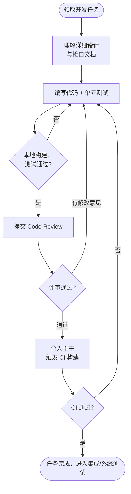

# 编码（Coding / Implementation）

## 阶段定位

编码回答的问题是：**如何把设计方案变成可运行的程序？**

编码阶段依据详细设计文档实现代码，是设计的"翻译"过程。编码的质量不取决于"写得多快"，而取决于代码是否正确、清晰、可维护。

## 主要工作

### 1. 编码实现
- 按照详细设计实现每个模块的功能
- 遵循团队的**编码规范**（命名、格式、注释、目录结构）
- 优先复用现有库和公共组件，避免重复造轮子

### 2. 单元测试
- 对每个函数、类编写单元测试，验证逻辑正确性
- 覆盖正常路径、边界条件和异常情况
- 关键业务逻辑应保证较高的测试覆盖率

### 3. 代码评审（Code Review）
- 提交前由他人审查代码：逻辑正确性、可读性、是否符合设计
- 这是编码阶段发现和修复问题成本最低的手段

### 4. 静态检查与调试
- 使用静态分析工具（Lint、编译器告警、安全扫描）排查低级错误
- 修复单元测试和联调中发现的问题

### 5. 版本管理
- 使用 Git 等工具管理代码，规范分支策略和提交信息
- 每次提交保持可构建、可测试，便于追溯和回滚

### 6. 持续集成（CI）
- 代码合入主干时自动构建、自动跑单元测试和静态检查
- 保证主干随时处于可用状态

## 开发工作流

## 产出物

| 产出物 | 内容 |
|--------|------|
| 源代码 | 符合设计和编码规范的程序代码 |
| 单元测试代码 | 覆盖模块逻辑的自动化测试 |
| 构建产物 | 可编译、可运行的程序包 |
| 代码注释与开发文档 | 说明复杂逻辑、外部依赖的使用方式 |

## 结束标志

- 计划范围内的功能编码完成
- 单元测试全部通过，达到约定的覆盖率
- 代码评审完成，问题已修复
- 代码集成到主干，CI 构建通过

## 常见问题与建议

- **偏离设计随意编码**：实现和设计文档脱节，后续维护者无法理解系统。如实现时发现设计不合理，应先反馈并更新设计，再编码。
- **不写单元测试**："先上线再补测试"往往等于永远不补。测试应随代码一起提交。
- **命名混乱、注释缺失或过量**：好代码应自解释，注释只说明"为什么"，不复述"做了什么"。
- **功能完成但质量欠账**：不处理异常、边界条件、并发问题，把风险转嫁给测试阶段。编码时就应考虑失败场景。
- **分支管理混乱**：长期不合并主干、一次性提交巨大代码量，导致合并冲突和集成风险。应小步提交、频繁集成。
