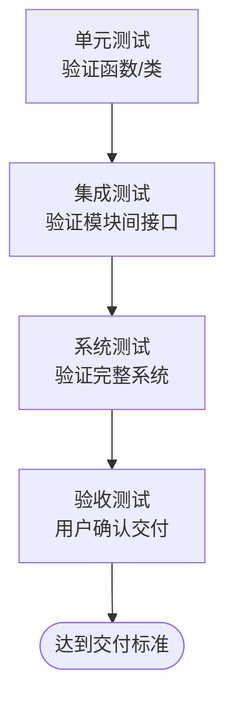
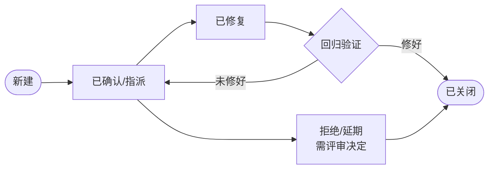

# 测试（Testing）

## 阶段定位

测试回答的问题是：**程序对不对？是否符合需求？**

测试的目的是**验证**系统满足需求，并**尽早发现缺陷**。它不是开发完成后的"最后一道关卡"，而应贯穿全程——本阶段文档描述的是系统级的集中测试活动。

## 主要工作

### 1. 测试计划
- 明确测试范围、策略、资源、进度和出口标准
- 规划测试环境、测试数据的准备方案

### 2. 测试设计
- 依据需求规格说明书编写**测试用例**（前置条件、输入、操作步骤、预期结果）
- 常用用例设计方法：等价类划分、边界值分析、场景法、错误推测法
- 用例应覆盖全部需求条目（对照需求跟踪矩阵）

### 3. 测试执行（由内到外四个层次）

| 层次 | 内容 | 由谁执行 | 对应关系（V 模型） |
|------|------|----------|---------------------|
| 单元测试 | 验证单个函数/类 | 开发（编码阶段完成） | 详细设计 |
| 集成测试 | 验证模块之间的接口和数据传递 | 开发/测试 | 概要设计 |
| 系统测试 | 对完整系统做功能、性能、安全、兼容性验证 | 独立测试团队 | 需求分析 |
| 验收测试（UAT） | 由用户确认系统达到交付标准 | 用户方 | 需求/合同 |

> 测试对象逐层放大：从函数，到模块组合，到完整系统，最后到用户认可。每层发现的缺陷先修复并回归，再进入下一层。

### 4. 缺陷管理
- 记录缺陷（复现步骤、期望/实际结果、严重程度、优先级）
- 跟踪缺陷状态流转：

- 分析缺陷趋势，判断质量是否收敛

### 5. 回归测试
- 每次修复缺陷或改动代码后，重新执行相关测试
- 确认修复有效且没有引入新问题；核心流程建议自动化回归

## 产出物

| 产出物 | 内容 |
|--------|------|
| 测试计划 | 范围、策略、资源、进度、出口标准 |
| 测试用例 | 覆盖需求的可执行验证步骤 |
| 缺陷报告 | 每个缺陷的详细描述与状态跟踪 |
| 测试报告 | 测试结果汇总、遗留缺陷、质量结论与发布建议 |

## 结束标志

- 计划的测试全部执行完毕
- 严重缺陷全部修复，遗留缺陷经评估可接受
- 缺陷趋势收敛（新增缺陷明显下降）
- 测试报告评审通过，达到出口标准

## 常见问题与建议

- **只测正常路径**：用户真正踩坑的往往是边界条件和异常输入，测试设计应重点覆盖这些场景。
- **测试介入太晚**：等编码全部完成才介入，问题发现太晚。测试用例可在设计阶段同步编写，自动化测试可并入持续集成（"测试左移"）。
- **回归靠人肉**：改动频繁的项目应建设自动化回归测试，保证核心流程可反复验证。
- **把"没测出问题"当成"没有问题"**：测试只能证明缺陷存在，不能证明缺陷不存在。发布决策应基于风险综合评估。
- **缺陷无人闭环**：只报不修、修了不验，缺陷状态长期悬空。应有明确的缺陷管理机制和例会跟进。
