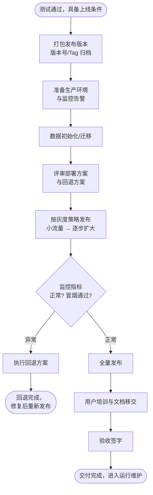

# 部署与交付（Deployment & Delivery）

## 阶段定位

部署与交付回答的问题是：**如何把系统安全地送到用户手上？**

测试通过后，系统进入生产环境。这个阶段的核心不是"把程序跑起来"这么简单，而是要保证：数据不丢失、业务不中断、出问题能快速回退、用户会用。

## 主要工作

### 1. 发布准备
- 打包构建发布版本，打版本号标签（Tag），归档源代码与依赖
- 准备生产环境：服务器、网络、域名、证书、监控告警
- 制定**部署方案**和**回退方案**（出问题时如何快速回到旧版本）
- 编写上线检查清单（Checklist），逐项确认

### 2. 数据准备与迁移
- 初始化基础数据（字典、配置、账号权限）
- 如有旧系统，执行数据迁移并做数据一致性校验

### 3. 发布方式选择
根据业务对中断的容忍度选择发布策略：

| 策略 | 做法 | 特点 |
|------|------|------|
| 停机发布 | 停服后更新再启动 | 简单，但有服务中断窗口 |
| 蓝绿发布 | 新旧两套环境，切换流量 | 可秒级回退，资源成本翻倍 |
| 灰度/金丝雀发布 | 先放一小部分流量到新版本，逐步扩大 | 风险可控，是生产环境首选 |
| 滚动发布 | 逐台/逐批更新实例 | 无需双倍资源，回退较慢 |

### 4. 上线与验证
- 按方案执行部署，完成后做**冒烟测试**（Smoke Test）验证核心流程
- 观察监控指标（错误率、响应时间、资源占用）确认系统健康

### 5. 交付与移交
- **用户培训**：操作培训、管理员培训
- **文档移交**：用户手册、管理员手册、运维手册、源代码与设计文档
- **验收签字**：用户方按验收标准确认，项目正式交付
- 与运维团队交接：值班机制、告警响应流程

## 流程图

## 产出物

| 产出物 | 内容 |
|--------|------|
| 部署方案 | 部署步骤、发布策略、回退方案、人员分工 |
| 上线检查清单 | 上线前后逐项确认的检查项 |
| 用户手册 / 运维手册 | 面向使用者和运维者的操作文档 |
| 培训材料与培训记录 | 帮助用户上手的教学材料 |
| 验收报告 | 用户方签字确认的交付凭证 |

## 结束标志

- 系统在生产环境稳定运行（如连续 N 天无严重故障）
- 验收报告签字确认，文档和培训移交完成
- 运维交接完成，进入运行与维护阶段

## 常见问题与建议

- **没有回退方案**：一旦上线异常只能现场救火。任何发布前都必须回答"出问题怎么退回来"。
- **首次全量发布**：新系统第一次上线就放全部流量，风险极大。生产环境发布应始终从小流量开始。
- **数据迁移不校验**：迁移后不比对记录数、关键字段和汇总值，数据问题往往上线数天后才暴露。
- **上线即散场**：项目组一交付就解散，无人响应初期问题。应安排上线护航期（如 1~2 周重点保障）。
- **文档缺失**：没有运维手册和部署文档，几个月后除了原作者没人能动这个系统。
