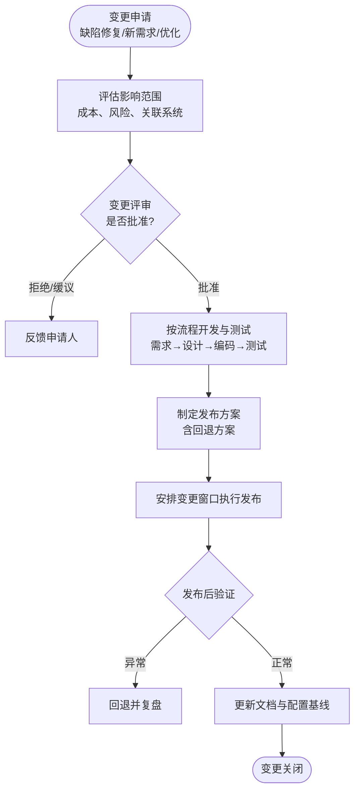

# 运行与维护（Operation & Maintenance）

## 阶段定位

运行与维护回答的问题是：**系统上线后，如何持续稳定地创造价值？**

交付不是终点。系统上线后进入漫长的运行期，需要持续监控、响应故障、处理变更。这是整个生命周期中**持续时间最长、成本占比最高**的阶段（通常占总成本 60% 以上），维护质量直接决定系统的实际价值。

## 主要工作

### 1. 日常运行保障
- 监控系统指标：可用性、响应时间、错误率、资源占用
- 告警响应与值班机制：分级响应，快速恢复优先（先止血，后查因）
- 定期巡检、备份与容灾演练

### 2. 四类维护活动

| 类型 | 英文 | 内容 | 示例 |
|------|------|------|------|
| 纠正性维护 | Corrective | 修复运行中暴露的缺陷 | 下单偶发失败，定位并修复 |
| 适应性维护 | Adaptive | 适配环境变化 | 操作系统升级、数据库版本更换、接口方变更 |
| 完善性维护 | Perfective | 按用户新需求增强功能 | 增加新的统计报表、优化操作流程 |
| 预防性维护 | Preventive | 提前消除隐患、改善可维护性 | 重构僵尸代码、升级依赖版本、优化慢查询 |

> 实践中**完善性维护占比最高**（约一半），其次是纠正性维护。

### 3. 变更管理
所有对生产系统的修改都必须走受控流程，严禁绕过流程直接改线上：

> 注意：一个"小改动"经过的仍然是完整的开发循环——只是规模可以按比例缩减（如用轻量的设计说明和用例评审代替正式评审会）。

### 4. 问题复盘与知识沉淀
- 对重大故障做根因分析（RCA），形成改进措施并跟踪闭环
- 维护过程产生的知识（架构变更、历史决策）及时回填文档

### 5. 系统退役（终点）
当系统不再有维护价值时，有序下线：
- 评估替代方案，通知用户并安排迁移
- 按合规要求归档或销毁数据
- 下线服务、释放资源，归档全部文档与代码

## 产出物

| 产出物 | 内容 |
|--------|------|
| 运维手册 | 日常巡检、常见故障处理、应急联系机制 |
| 变更单/工单 | 每次变更的申请、审批、执行记录 |
| 版本发布说明 | 每个版本改了什么、有什么影响 |
| 故障报告与复盘 | 故障经过、根因分析、改进措施 |
| 维护记录与统计 | 各类维护的工作量、趋势分析 |

## 结束标志

维护阶段没有"结束标志"，它一直持续到系统**退役下线**——文档归档完成、数据妥善处置、资源释放，才是这个软件生命周期的真正终点。

## 常见问题与建议

- **重开发轻维护**：把维护交给新人"练手"，结果核心系统被改得千疮百孔。维护同样需要熟悉系统的人参与，并保持 Code Review。
- **绕过流程改线上**："就改一行，不走流程"是重大事故最常见的起因。任何线上变更都必须可追溯、可回退。
- **文档失修**：上线后架构早已改了几轮，文档还停在交付版。应把"同步更新文档"作为变更关闭的条件之一。
- **技术债务堆积**：只加功能不还债，系统越来越难改。建议在每次迭代中预留固定比例（如 10%~20%）的工时做重构和还债。
- **只救火不防火**：反复出现同类故障说明只有纠正、没有预防。复盘出的改进措施必须跟踪落地。
