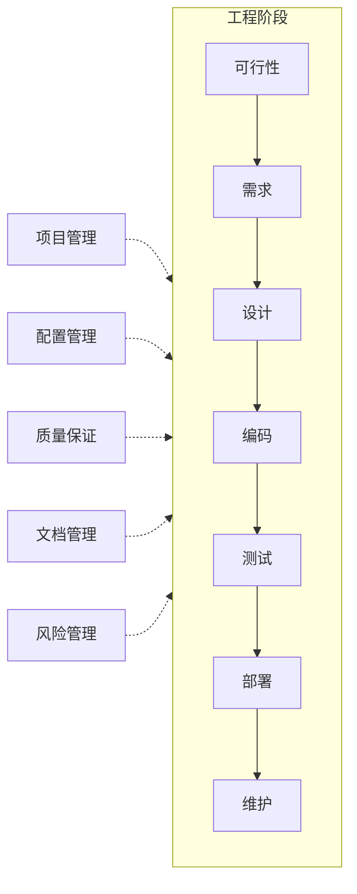
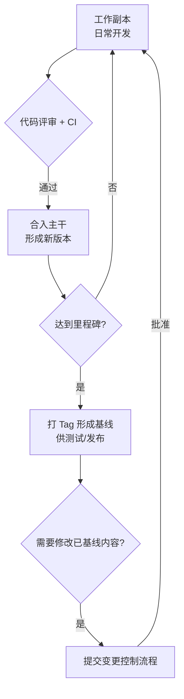

# 支持性过程（Supporting Processes）

## 定位

项目管理、配置管理、质量保证等活动不属于某一个具体阶段，而是**贯穿整个软件生命周期**。它们不直接产出代码，但决定了项目能否按时、按质、可控地交付。

## 1. 项目管理（Project Management）

在范围、时间、成本、质量的约束下，协调资源达成项目目标。

- **范围管理**：明确做什么、不做什么；控制需求蔓延
- **进度管理**：任务分解（WBS）、排期、里程碑跟踪（甘特图/燃尽图）
- **成本管理**：预算编制与成本监控
- **人员管理**：角色分工（项目经理、产品、开发、测试、运维）、沟通机制（站会、周报、评审会）
- **风险管理**：识别 → 评估（概率×影响）→ 应对（规避/转移/减轻/接受）→ 监控
- **干系人管理**：管理客户、领导、用户的期望与沟通

> 经典的"项目管理铁三角"：范围、时间、成本相互制约，质量是三者平衡的结果。压进度通常意味着砍范围或降质量，需要显式决策而不是默认发生。

## 2. 配置管理（Software Configuration Management, SCM）

保证任何时刻都能**找回任意版本、说清每次变化**。

- **版本控制**：代码、文档纳入 Git 等工具统一管理，规范分支策略
- **基线管理**：需求、设计、代码在评审通过后形成基线，基线变更必须走流程
- **变更控制**：变更申请 → 影响评估 → 变更委员会（CCB）审批 → 实施 → 验证关闭
- **构建与发布管理**：可重复的构建过程，版本号规范，产物归档
- **环境与配置管理**：开发/测试/生产环境的配置区分管理，配置项可追溯

## 3. 质量保证（Quality Assurance, QA）

QA 关注的是**过程**质量——通过规范过程来保证产品质量；测试关注的是**产品**质量本身。两者互补。

- **过程规范**：制定并维护各阶段的流程、模板、编码规范
- **阶段评审**：每个阶段结束时的评审会是质量闸门，不通过不放行
- **过程审计**：检查项目是否按既定流程执行（如：需求是否评审过、代码是否都过 Review、变更是否走流程）
- **度量分析**：缺陷密度、评审发现问题数、返工率等指标，用数据改进过程

## 4. 文档管理

文档是阶段之间的"契约"，是软件工程区别于"随意写代码"的关键。

- 每个阶段的产出物有统一模板，评审通过后归档为基线
- 文档与代码同版本管理，变更同步更新
- 建立文档索引，保证"人走了，知识留下"

## 5. 各阶段与支持过程的对应关系

| 阶段 | 项目管理关注点 | 配置管理关注点 | 质量保证关注点 |
|------|----------------|----------------|----------------|
| 可行性 | 立项、预算、里程碑 | 项目仓库初始化 | 立项评审 |
| 需求 | 范围确认、需求排期 | 需求文档基线 | 需求评审 |
| 设计 | 技术资源、进度细化 | 设计文档基线 | 设计评审 |
| 编码 | 任务跟踪、日常沟通 | 代码分支与版本控制 | 代码评审、CI |
| 测试 | 质量状态、风险上报 | 测试用例与报告归档 | 测试出口标准检查 |
| 部署 | 上线协调、培训安排 | 发布版本 Tag 与产物归档 | 上线检查清单 |
| 维护 | 运维排班、变更排期 | 线上配置与变更记录 | 变更审批、故障复盘 |

## 常见问题与建议

- **项目管理变成填表**：计划一次性做完再不更新，失去了指导意义。计划应随实际进展滚动修正。
- **没有基线概念**：需求和代码随时在变又无记录，出了问题说不清"当时是什么样"。基线 + 变更控制是解决之道。
- **QA 变成"检查作业"**：只在项目结束时审计打分。QA 应前置到过程设计阶段，帮项目把流程建对，而不是事后追责。
- **支持过程与工程过程脱节**：流程为流程而流程，增加负担不创造价值。规范应随团队规模匹配——小团队可以轻流程，但不能没有流程。
